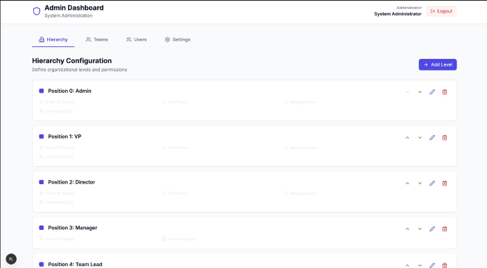
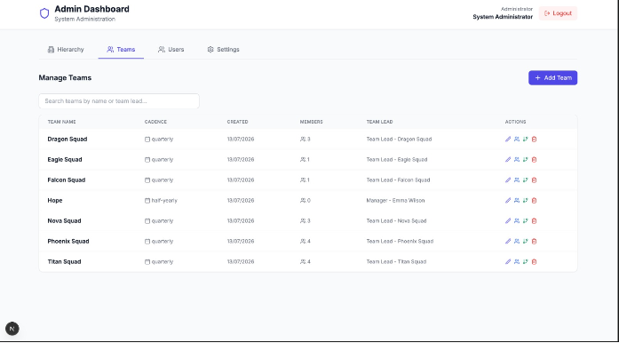
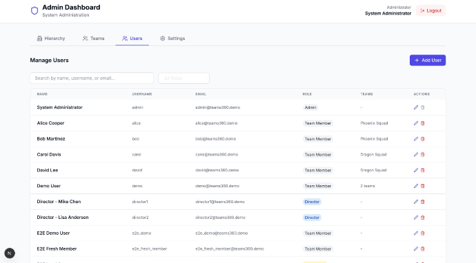
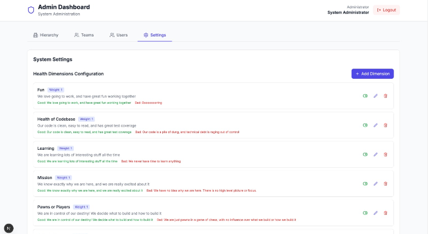
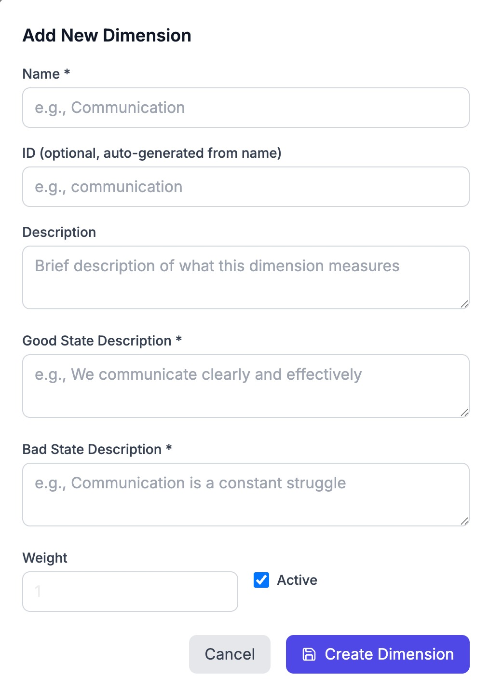

# Admin Page

This page documents the admin dashboard and the organizational setup workflow for Team360.

## Admin Dashboard Overview

The admin area is where an administrator configures the organization structure, team setup, and user access. It includes:

- Hierarchy configuration for roles and reporting levels
- Team management for team setup and cadence
- User management for user accounts and reporting chains
- System settings for health dimensions and related configuration

The dashboard is organized into four tabs: Hierarchy, Teams, Users, and Settings.

## Initial Setup

Before teams can start using Team360, an administrator needs to configure the organization structure. Log in as an admin (`admin/admin`) and navigate to the Admin Dashboard (`/admin`).

### Configure Hierarchy Levels

   
   
Admin can add new roles and customize hierarchy levels.

The hierarchy defines your organization's reporting structure and permissions. Default levels include:

| Level | Position | Typical Role | Key Permissions |
|-------|----------|--------------|-----------------|
| Level 1 | 1 | VP/Executive | View all teams, view analytics |
| Level 2 | 2 | Director | View all teams, view analytics |
| Level 3 | 3 | Manager | View assigned teams, view analytics |
| Level 4 | 4 | Team Lead | View own team, take surveys |
| Level 5 | 5 | Team Member | Take surveys only |

To customize hierarchy levels:

1. Go to Admin Dashboard → Hierarchy Levels tab
2. Click "Add Level" to create new levels
3. Configure permissions for each level:
   - **Can View All Teams**: See health data across the organization
   - **Can Edit Teams**: Modify team configurations
   - **Can Manage Users**: Add/remove users
   - **Can Take Survey**: Participate in health checks
   - **Can View Analytics**: Access trend analysis and reports
4. Use drag handles to reorder levels (higher position = higher authority)

### Create Teams

Teams are the core unit for health assessments. Each team has members and a designated lead.

   
   
Admin can view and add teams and assign leads.

1. Go to Admin Dashboard → Teams tab
2. Click "Add Team" and provide:
   - **Team Name**: A descriptive name (e.g., "Platform Squad", "Mobile Team")
   - **Team Lead**: Assign a user responsible for the team (optional)
   - **Cadence**: How often the team should complete health checks:
     - Weekly (high-velocity teams)
     - Biweekly (most common)
     - Monthly (stable teams)
     - Quarterly (strategic reviews)

### Add Users

Create user accounts for everyone who will participate in health checks.

   
   
Admin can view and add users, set roles, and manage reporting chains. Supervisors are chosen from higher hierarchy levels.

1. Go to Admin Dashboard → Users tab
2. Click "Add User" and provide:
   - **Username**: Login identifier
   - **Email**: Contact email
   - **Full Name**: Display name
   - **Password**: Initial password (users should change on first login)
   - **Hierarchy Level**: Their position in the organization
   - **Reports To**: Their direct supervisor (creates reporting chain)
3. After creating users, assign them to teams in the Teams tab

### System Settings

Use the System Settings area to manage the health dimensions shown to users. Admins can review the current dimensions and add new ones as needed.

   
   
Admin can configure health dimensions and add new ones, along with company branding, logo upload, email/slack notifications, and notify-on-submission.

   
   
Admin can add or customize health dimensions.

These screenshots use seeded sample data from the local database.